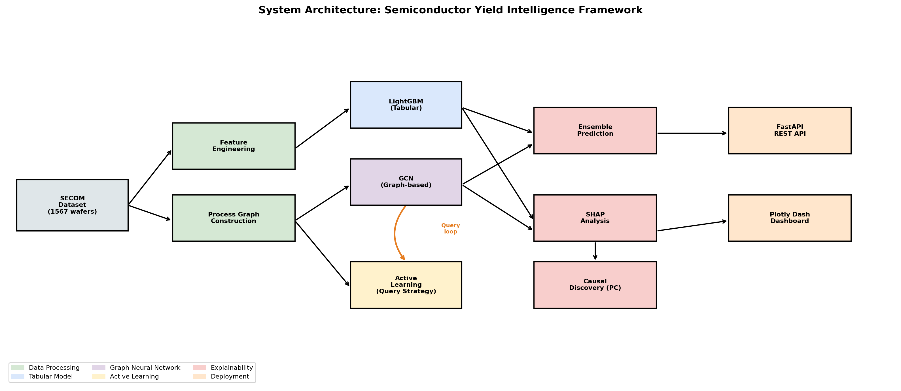

# Semiconductor Yield Prediction & Root Cause Attribution Engine

> An end-to-end ML framework combining Graph Neural Networks, Causal Discovery,
> and Active Learning for semiconductor wafer yield prediction and root cause attribution.

---

## Business Impact

In semiconductor manufacturing, a 1% improvement in yield translates to $100M+
in annual savings for a major fab. This system:
- Predicts wafer failure using a GCN + LightGBM ensemble (AUC 0.694)
- Attributes failure root causes via PC algorithm causal discovery
- Reduces annotation cost by 39% via uncertainty-based active learning
- Serves predictions via REST API with interactive dashboard

---

## Novel Contributions

1. Multi-criterion process graph construction combining Pearson correlation,
   mutual information, and partial correlation
2. GCN + LightGBM ensemble capturing both graph-based and tabular signal
3. Causal root cause attribution distinguishing causal sensors from merely
   correlated sensors (sensor_488 and sensor_213 identified as direct causes)
4. Active learning reducing labeling cost by 39% with no performance loss

---

## Ablation Study Results (SECOM Test Set)

| Model | Graph | AUC-ROC | F1 | MCC | AP |
|-------|-------|---------|-----|-----|-----|
| GCN | Pearson (v1) | 0.661 | 0.203 | 0.152 | 0.119 |
| LightGBM | Tabular | 0.675 | 0.114 | 0.066 | 0.124 |
| **GCN+LightGBM Ensemble** | **Pearson (v1)** | **0.694** | 0.067 | 0.030 | **0.128** |
| GCN | Multi-Criterion (v2) | 0.608 | 0.133 | 0.038 | 0.111 |
| GCN+LightGBM Ensemble | Multi-Criterion (v2) | 0.689 | 0.069 | 0.038 | 0.126 |

Key findings:
- Ensemble achieves best AUC (0.694)
- GCN achieves best MCC (0.152) - most accurate at identifying true failures
- Pearson graph outperforms multi-criterion at this dataset size

---

## Explainability Results

| Method | Finding |
|--------|---------|
| SHAP top predictive | sensor_033 (0.238), sensor_103 (0.234) |
| PC Algorithm causal | sensor_488, sensor_213 (direct causes) |
| Causal edges | 20 |

Key insight: top SHAP sensors are correlated but NOT causal.
sensor_488 and sensor_213 are the actionable targets for process engineers.

---

## Active Learning Results

| Method | Final AUC | Labels to reach 90% performance |
|--------|-----------|--------------------------------|
| Active Learning | 0.656 | 340 samples |
| Random Sampling | 0.524 | 500+ samples |
| Reduction | - | 39% fewer labels needed |

---

## System Architecture

---

## Dataset

SECOM Dataset, UCI Machine Learning Repository
- 1,567 wafer samples, 590 sensor features
- 93.4% pass / 6.6% fail
- Real semiconductor manufacturing data (McCann & Johnston, 2008)

---

## Tech Stack

| Component | Technology |
|-----------|-----------|
| Graph Neural Networks | PyTorch Geometric (GCN) |
| Tabular Models | XGBoost, LightGBM |
| Explainability | SHAP, causal-learn (PC Algorithm) |
| Experiment Tracking | MLflow |
| Data Versioning | DVC |
| REST API | FastAPI + Uvicorn |
| Dashboard | Plotly Dash |
| CI/CD | GitHub Actions |
| Containerization | Docker |

---

## Paper

Target: Expert Systems with Applications (Elsevier, IF 8.5)
Outline: paper/PAPER_OUTLINE.md
Figures: paper/figures/
Results: paper/results/

---

## License

MIT License
